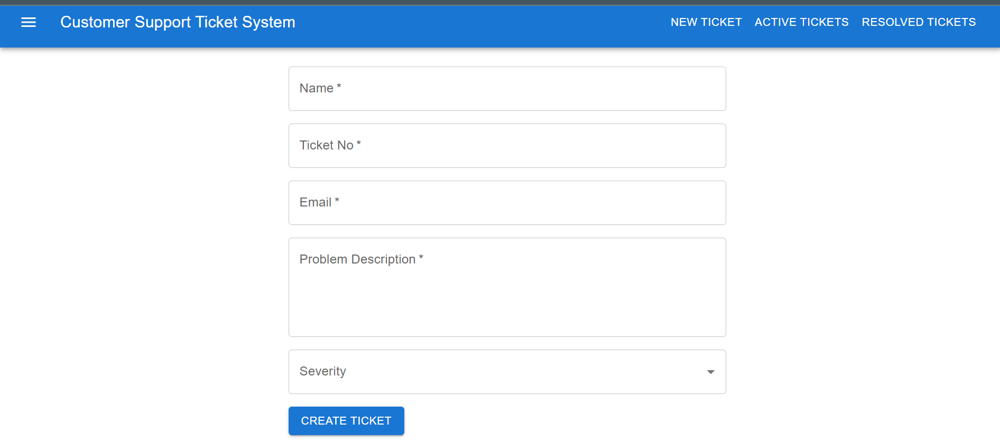
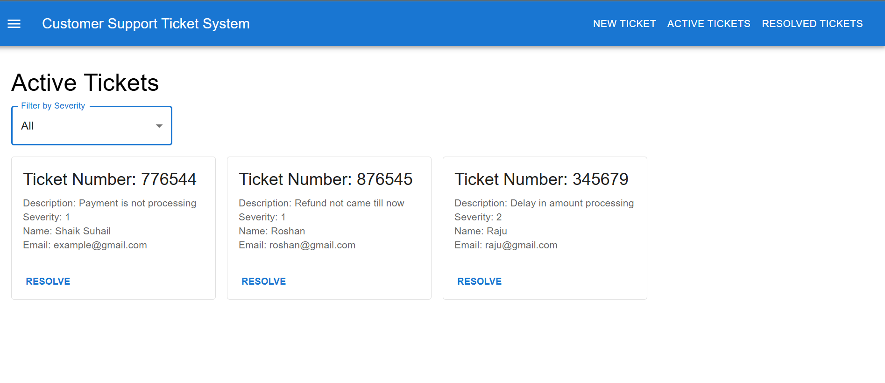
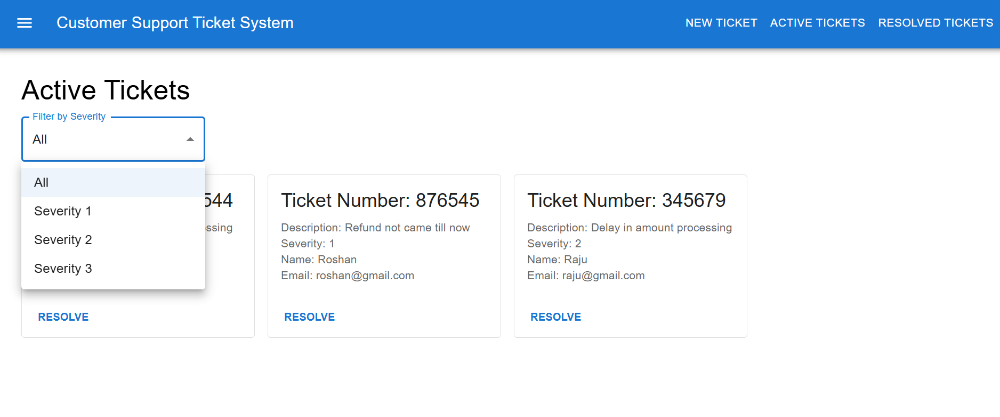
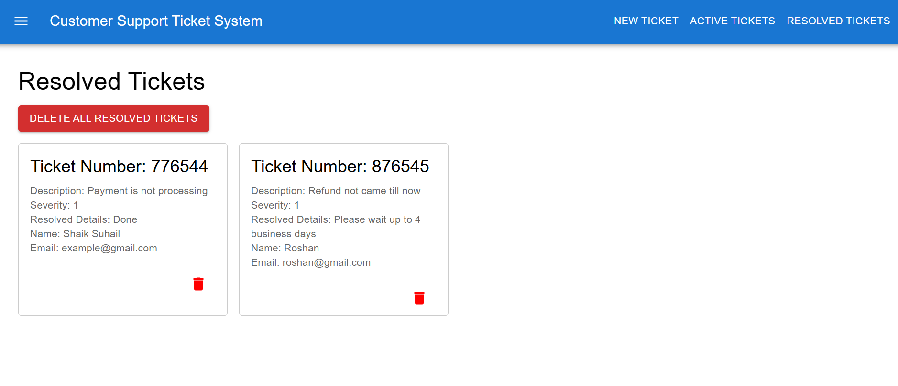

## Customer Support Ticket System

A web-based customer support ticket management system that allows users to submit, track, and manage support tickets effectively. Built with a React frontend, Node.js backend, and MongoDB database. The system uses Queues to manage ticket processing and Linked Lists for organizing resolved tickets.

## Features

## Project Features

- **Ticket Submission**: Users can submit tickets with issue details, severity, and contact information.
- **Ticket Management**: Admins can view, resolve, and delete tickets.
- **Resolved Tickets Archive**: Resolved tickets are stored in a linked list structure for organized access. Tickets can be deleted individually or all at once.
- **Ticket Processing Queue**: Tickets are processed in the order of submission using a queue structure to ensure fair and systematic handling.
- **Modals for Confirmation**: Modals are displayed to confirm actions like ticket deletion, ensuring that changes are deliberate.
- **Responsive Design**: The user interface is optimized for accessibility on various devices, providing a seamless experience across desktops, tablets, and mobile devices.

## Technologies Used

- **Frontend** : React.js, Material UI

- **Backend** : Node.js, Express.js, Mongoose (for MongoDB)

- **Database** : MongoDB

## Data Structures

## Queue
Purpose: Tickets are stored in a queue to manage submission order. New tickets are enqueued, and they’re processed in a First-In-First-Out (FIFO) order to maintain service fairness.
Implementation: The backend uses a custom queue data structure to manage ticket processing. This is useful for scenarios where ticket priority may later be introduced based on severity or other factors.

## Linked List
Purpose: Resolved tickets are stored in a linked list for easy insertion and deletion, especially when tickets need to be archived and accessed sequentially.
Implementation: A singly linked list structure is used to keep track of resolved tickets. The head of the list points to the most recently resolved ticket, allowing for efficient removal and storage.

1. Clone the Repository:
    ``bash
    git clone https://github.com/shaiksuhail01/Customer-Support-Ticket-System-App.git

2. Install Backend Dependencies
    ``bash
    cd backend
    npm install
3. Install Frontend Dependencies
    ``bash
    cd frontend
    npm install
4. Start the App:
    ``bash 
    npm start
